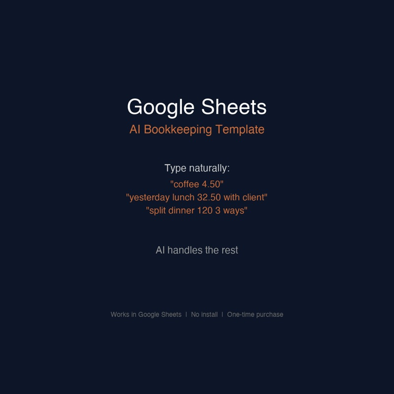
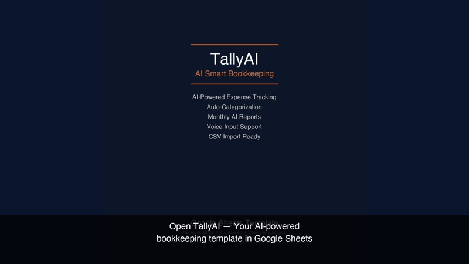

# TallyAI — AI-Powered Bookkeeping for Google Sheets

**Describe expenses in plain English. AI auto-categorizes them. No installations, no API keys, no learning curve.**

[📋 Install on Google Sheets](#-installation) · [⭐ Upgrade to Pro (75% off)](https://tallyai.etsy.com?coupon=SEED100) · [📖 Documentation](docs/guide.md)

---

## ✨ What It Does

TallyAI turns Google Sheets into a smart bookkeeping system. Instead of manually sorting transactions into categories, you just describe what you spent:

```
"coffee 4.50"           →  $4.50  |  Food & Drink
"client invoice $1200"  →  $1200  |  Salary
"weekly grocery run 85" →  $85    |  Groceries
"uber to airport 35"    →  $35    |  Transportation
```

The AI extracts date, amount, and category automatically. **It works offline** with local pattern matching.



---

## 🚀 Installation

### Option 1: Quick Start (Recommended)
1. **Create a new Google Sheet** at [sheets.new](https://sheets.new)
2. Go to **Extensions → Apps Script**
3. Delete any default code, then copy each file from [`apps-script/`](apps-script/) into the editor (named the same way)
4. Click **Run** → `onOpen` (authorize when prompted)
5. Reload the sheet — you'll see the **AI Bookkeeping** menu
6. Open **AI Bookkeeping → Quick Entry** and start typing

### Option 2: Using clasp (for developers)
```bash
# Install clasp
npm install -g @google/clasp

# Login
clasp login

# Clone this repo
git clone https://github.com/zenH-jpg/tallyai.git
cd tallyai

# Create a new Google Sheet + script
clasp create --title "AI Bookkeeping" --type sheets
clasp push

# Open the sheet
clasp open
```
Then run `onOpen` from the Apps Script editor to initialize.

### First-Time Authorization

Google will ask for permissions — this is normal:

- **View and manage your spreadsheets** — needed to read/write entries
- **Connect to an external service** — needed for the AI categorization API
- **Display a sidebar** — needed for the Quick Entry interface

---

## 🎯 Features

| Feature | Free Edition | Pro Edition |
|---------|:-----------:|:----------:|
| AI categorization | ✅ | ✅ |
| Quick Entry sidebar | ✅ | ✅ |
| Dashboard with charts | ✅ | ✅ |
| Multiple languages | — | 7 languages |
| Entry limit | 50 entries | Unlimited |
| CSV bank import | — | ✅ |
| AI monthly reports | ✅ Basic | ✅ AI-powered |
| Multi-currency | — | ✅ |
| Auto-learning | — | ✅ |
| Priority support | — | ✅ |
| **Price** | **Free** | **$12.99** |

👉 **[Upgrade to Pro (75% off with SEED100) →](https://tallyai.etsy.com?coupon=SEED100)**

---

## 📁 Project Structure

```
tallyai/
├── apps-script/           # Google Apps Script source
│   ├── Code.gs            # Main entry point + menu + sidebar
│   ├── Config.gs          # Constants & configuration
│   ├── AIHelpers.gs       # AI categorization engine
│   ├── SheetManager.gs    # Sheet structure & initialization
│   ├── Sidebar.html       # Quick Entry UI
│   └── appsscript.json    # Script manifest
├── docs/
│   └── guide.md           # User guide
├── images/                # Screenshots
├── LICENSE
└── README.md
```

---

## 🧠 How the AI Works

The categorization engine works in two layers:

1. **Local pattern matching** (always available, offline) — Built-in keyword patterns recognize common expenses with ~70% accuracy. [See the patterns here](apps-script/AIHelpers.gs#L279-L296).

2. **Cloud AI enhancement** (optional, free) — When online, sends descriptions to a lightweight AI worker that improves accuracy to ~90%+. Understands natural language variations like "split dinner 120 3 ways".



---

## 🔒 Privacy

- **All data stays in your Google account.** No financial data leaves Google's servers.
- The optional AI call sends only the description text (not your sheet contents or balances).
- The source code is fully auditable.

---

## 🤝 Contributing

Contributions welcome:
- **Bug reports** — Open an issue
- **Category patterns** — Add keyword matches for better local categorization
- **Code improvements** — PRs welcome

---

## 📄 License

MIT — see [LICENSE](LICENSE) for details.

---

## 💡 Why Open Source?

Financial tools should be transparent. You can verify exactly what the template does, how it handles your data, and what gets sent where. No black boxes.

The free edition is fully functional for personal use. The [Pro edition](https://tallyai.etsy.com?coupon=SEED100) adds convenience features for business owners who need more power.

---

*Built for freelancers, solopreneurs, and small business owners.*
